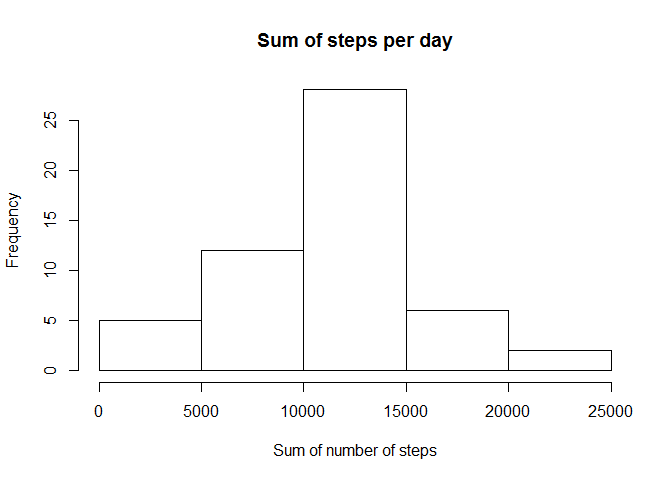
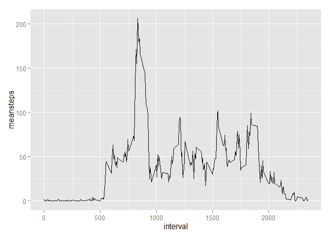
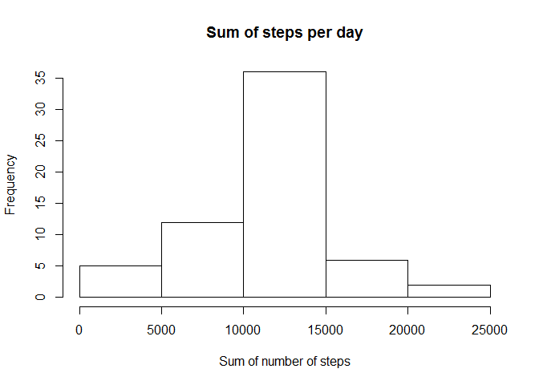
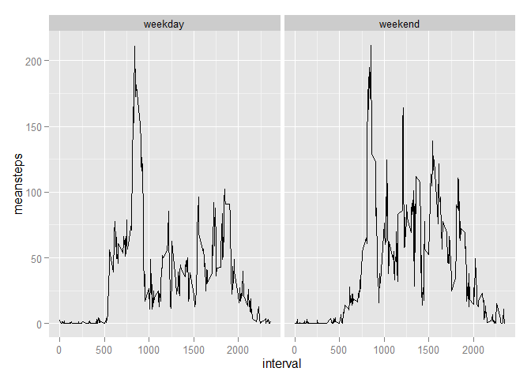

# Reproducible Research: Peer Assessment 1


# Personal activity monitoring #

## Introduction ##

This paper analyses personal activity data collected by activity monitoring device. This device collects data at 5 minute intervals through out the day. The data consists of two months of data from an anonymous individual collected during the months of October and November, 2012 and include the number of steps taken in 5 minute intervals each day.

## Loading and preprocessing the data ##


```r
setwd("C:/Work/R/reproducibleResearach/RepData_PeerAssessment1")
library(dplyr)
```

```
## 
## Attaching package: 'dplyr'
## 
## The following objects are masked from 'package:stats':
## 
##     filter, lag
## 
## The following objects are masked from 'package:base':
## 
##     intersect, setdiff, setequal, union
```

```r
library(lubridate)
library(ggplot2)
activity <- read.csv(unz("activity.zip","activity.csv"))
activity$date <- ymd(activity$date)
activitywona <- activity[!is.na(activity$steps),]
```

## What is mean total number of steps taken per day?


```r
activitybyday <- activitywona %>% 
    group_by(date) %>% 
    summarise(sumsteps = sum(steps))
hist(activitybyday$sumsteps, xlab = "Sum of number of steps", main = "Sum of steps per day")
```

 

```r
meansumsteps <- mean(activitybyday$sumsteps)
mediansumsteps <- median(activitybyday$sumsteps)
```
Median of sum of steps is 10765.
Mean of sum of steps is 1.0766189\times 10^{4}.

## What is the average daily activity pattern?


```r
activitybyinterval <- activitywona %>% 
    group_by(interval) %>% 
    summarise(meansteps = mean(steps))
ggplot(activitybyinterval, aes(interval, meansteps)) + geom_line()
```

 

```r
intervalmaxsteps <- activitybyinterval[which.max(activitybyinterval$meansteps),1]
```

Interval with average maximum number of steps is 835.

## Imputing missing values


```r
totna <- sum(is.na(activity))
activityfillna <- left_join(activity, activitybyinterval)
```

```
## Joining by: "interval"
```

```r
activityfillna <- activityfillna %>% 
    mutate(steps = ifelse(is.na(steps), meansteps, steps)) %>%
    select(steps, date, interval)
```

Missing values have been filled in using the average interval value.


```r
activitybyday2 <- activityfillna %>% 
    group_by(date) %>% 
    summarise(sumsteps = sum(steps))
hist(activitybyday2$sumsteps, xlab = "Sum of number of steps", main = "Sum of steps per day")
```

 

```r
meansumsteps2 <- mean(activitybyday2$sumsteps)
mediansumsteps2 <- median(activitybyday2$sumsteps)
```

After filling in the missing values:
Median of sum of steps is 1.0766189\times 10^{4}.
Mean of sum of steps is 1.0766189\times 10^{4}.
The filling of the missing values does not have a relevant impact on the mean and median.

## Are there differences in activity patterns between weekdays and weekends?


```r
activityweek <- activityfillna %>% 
    mutate(weekday = wday(date), temp = weekdays(date)) %>% 
    mutate(daytipe = ifelse(weekday == 1 | weekday == 6, "weekend", "weekday")) %>%
    select(steps, interval, daytipe) %>%
    group_by(interval, daytipe) %>%
    summarise(meansteps = mean(steps))
activityweek$daytipe <- as.factor(activityweek$daytipe)
t <- ggplot(activityweek, aes(interval, meansteps)) + geom_line()
t + facet_wrap(~daytipe)
```

 

There are notable differences between weekdays and weekends values:

- more activity in the morning hours (600 to 800)
- secondary peaks around 1230 and 1600
- generally more activity during whole day

The main peak number of steps is almost identical in value and interval (around 900).
